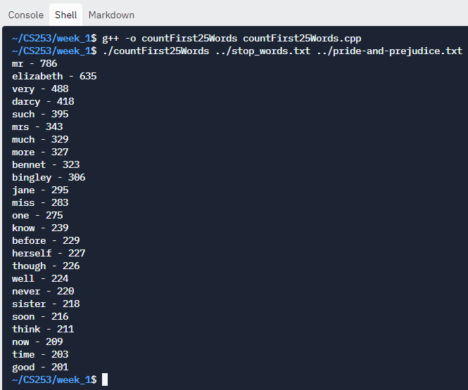

# Compile and run the program using the following commands
## Week 1
In the shell window, write:
```
cd week_1
g++ -o countFirst25Words countFirst25Words.cpp
./countFirst25Words ../stop_words.txt ../pride-and-prejudice.txt
```

