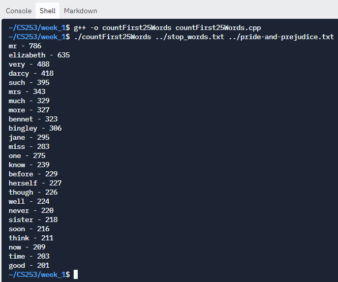
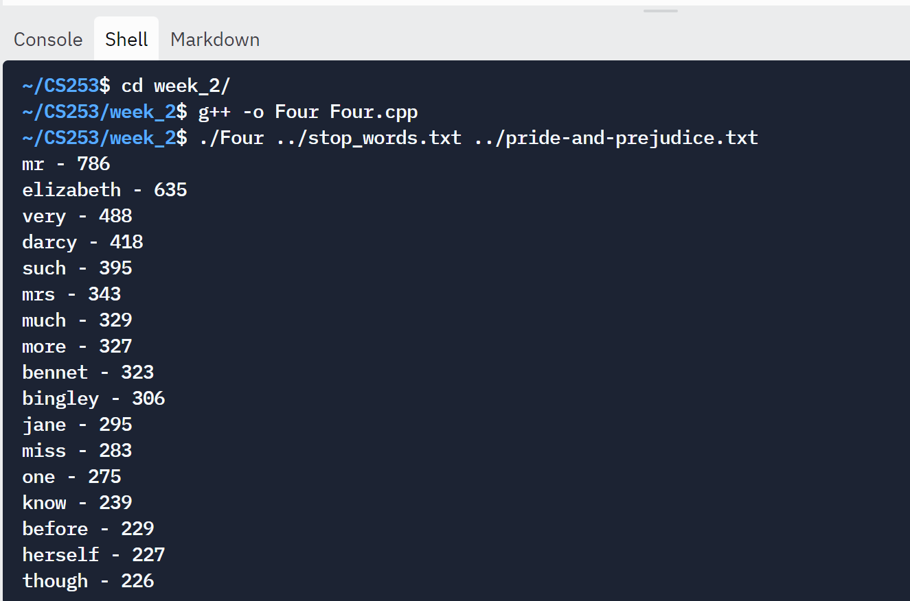
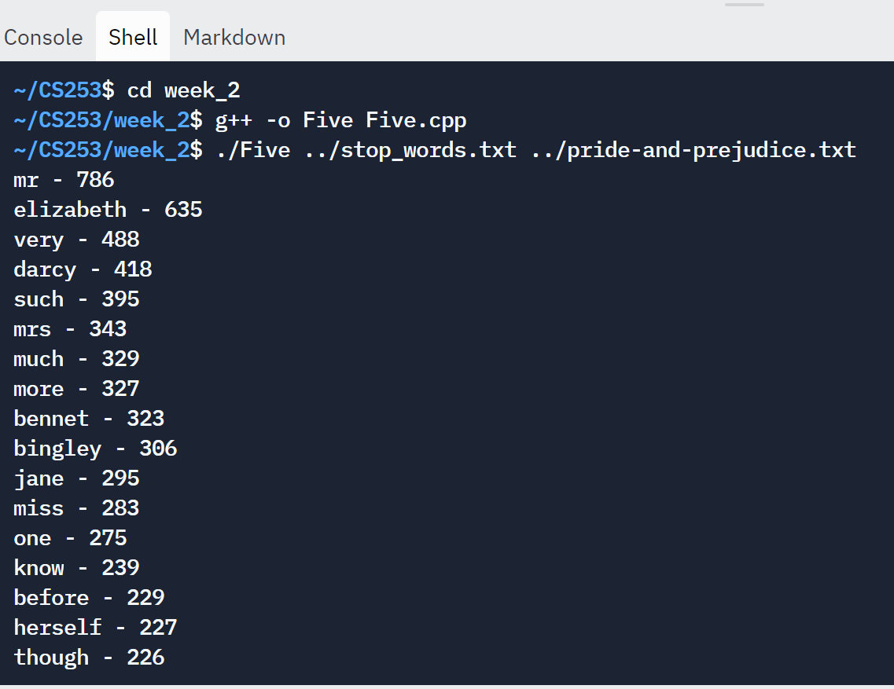
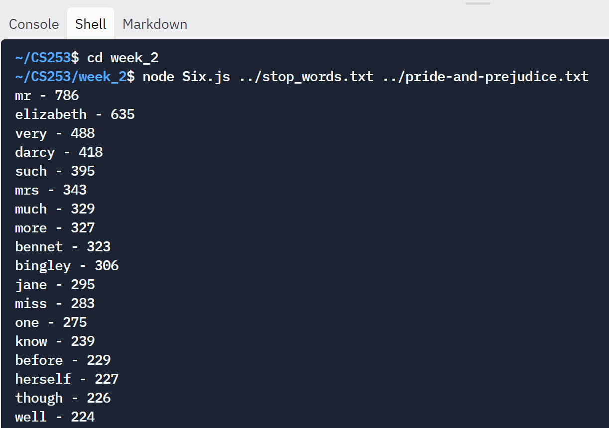
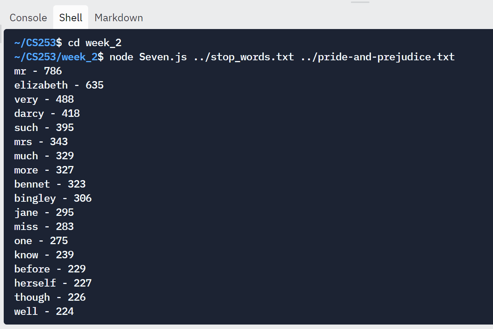

# Compile and run the program using the following commands
## Week 1
In the shell window, write:
```
cd week_1
g++ -o countFirst25Words countFirst25Words.cpp
./countFirst25Words ../stop_words.txt ../pride-and-prejudice.txt
```


## Week 2
### Exercise 4
In the shell window, write:
```
cd week_2
g++ -o Four Four.cpp
./Four ../stop_words.txt ../pride-and-prejudice.txt
```

### Exercise 5
In the shell window, write:
```
cd week_2
g++ -o Five Five.cpp
./Five ../stop_words.txt ../pride-and-prejudice.txt
```

### Exercise 6
In the shell window, write:
```
cd week_2
node Six.js ../stop_words.txt ../pride-and-prejudice.txt
```

### Exercise 7
In the shell window, write:
```
cd week_2
node Seven.js ../stop_words.txt ../pride-and-prejudice.txt
```
